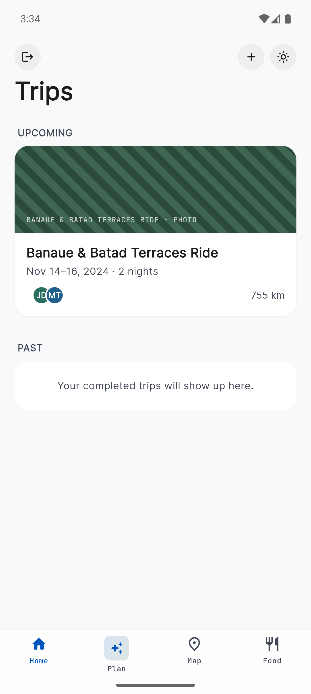
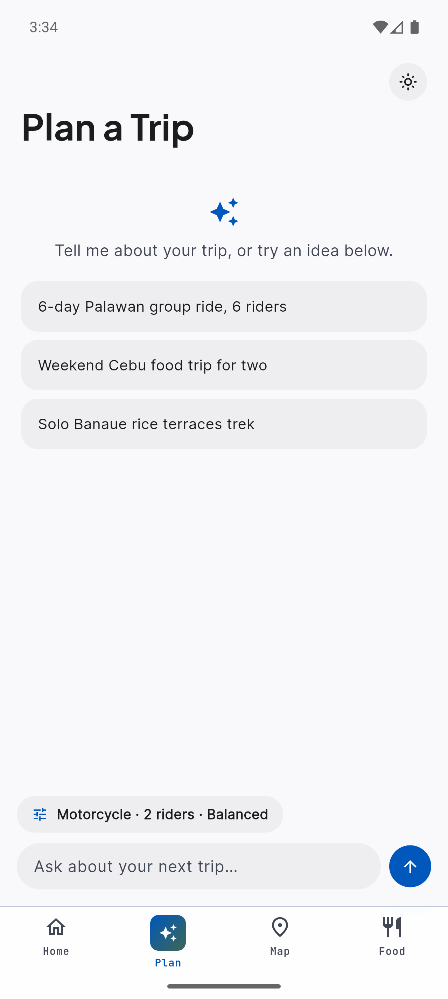
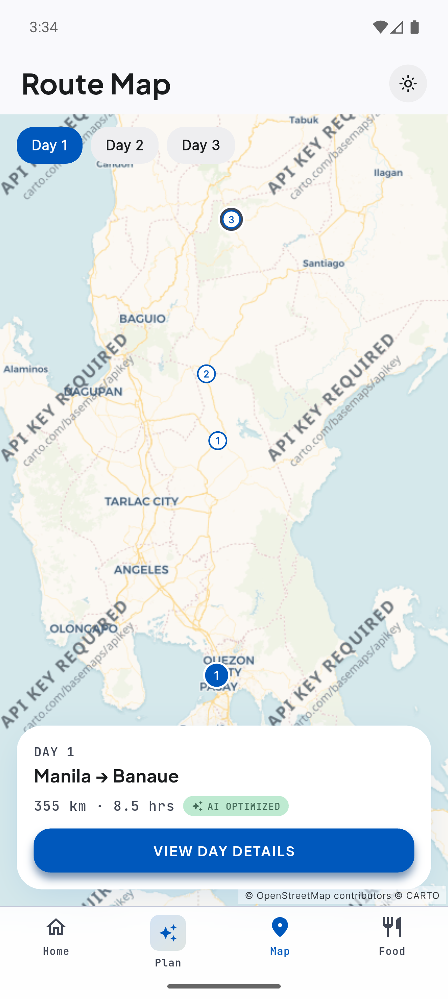
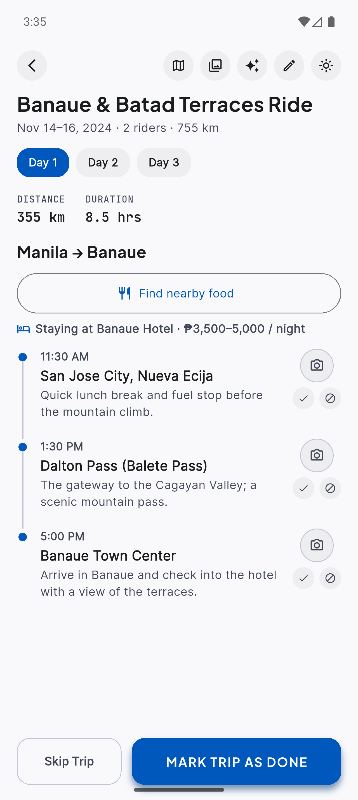

# Kalsada

**An AI-assisted group travel planner built with Flutter.**

Kalsada helps groups turn a travel idea into a practical trip: a day-by-day
itinerary, route context, budget and gear lists, shared trip progress, and
photos captured along the way. Android is the supported target today.

The app runs locally with seeded demo data when a backend is not configured,
so you can explore the experience without credentials.

## App showcase

These screens are captured from the Android app using Kalsada's seeded Banaue
and Batad group ride. Together they show the core flow: choose a trip, plan with
AI, understand the route, and work through each day's itinerary.

<table>
  <tr>
    <th align="center">Trips</th>
    <th align="center">AI planner</th>
    <th align="center">Route map</th>
    <th align="center">Itinerary</th>
  </tr>
  <tr>
    <td></td>
    <td></td>
    <td></td>
    <td></td>
  </tr>
  <tr>
    <td align="center">Upcoming and past group trips</td>
    <td align="center">Conversational trip generation</td>
    <td align="center">Day-by-day route context</td>
    <td align="center">Stops, lodging, photos, and progress</td>
  </tr>
</table>

## What it does

- Generate a complete trip from a conversational prompt and planning options.
- Browse and edit a day-by-day itinerary with stops, accommodation, and costs.
- Track individual stops and whole trips as done or skipped.
- Explore each trip on an interactive OpenStreetMap route view.
- Hand a day or stop off to the device's maps app for navigation.
- Search for nearby food around an itinerary day's saved location—without GPS,
  a places API, or an AI request.
- Capture and review trip photos by itinerary stop.
- Continue working with locally cached trip data when offline.

## Feature guide

The detailed product and implementation documentation lives in [`docs/`](./docs).

| Area | Description | Documentation |
| --- | --- | --- |
| Onboarding | Four-step introduction and sign-in entry points | [Onboarding](./docs/onboarding.md) |
| Authentication | Email/password authentication with Supabase or local fallback | [Auth](./docs/auth.md) |
| Trips | Upcoming and past trips, shared demo data, and trip status | [Trips](./docs/trips.md) |
| AI planner | Conversational trip generation and planning constraints | [Planner](./docs/planner.md) |
| Itinerary | Daily stops, editing, AI refinement, progress, maps, and photos | [Itinerary](./docs/itinerary.md) |
| Route map | Interactive OpenStreetMap view and external directions | [Route Map](./docs/route-map.md) |
| Nearby food | External maps search today; restaurant discovery placeholder for later | [Nearby Food](./docs/nearby-food.md) |
| Gallery | Stop-tagged photos and full-screen viewer | [Gallery](./docs/gallery.md) |
| Offline support | Drift cache, sync outbox, and map/photo caching | [Offline Support](./docs/offline.md) |

## Tech stack

- **Flutter** and Material 3 for the mobile app
- **MobX** for application state and **get_it** for dependency injection
- **go_router** for declarative navigation
- **Freezed** for immutable data models
- **Supabase** for authentication, realtime trip storage, photo storage, and
  the optional AI trip-planning edge function
- **Drift** and `connectivity_plus` for offline cache and sync outbox support
- **flutter_map** with OpenStreetMap/CARTO tiles for route exploration

## Architecture

```text
UI (screens/widgets) → MobX store → Repository contract ← implementation
                                                   ↑
                                                models
```

Feature stores depend on repository contracts, not concrete data sources.
`DependencyManager` selects the local fallback or Supabase-backed repository
at startup, and decorates the Supabase-backed trip/photo repositories with the
offline cache when configured.

See the contributor guidance in [AGENTS.md](./AGENTS.md) for the project's
full architecture and testing conventions.

## Get started

### Prerequisites

- Flutter SDK compatible with Dart `^3.12.2`
- Android Studio / Android SDK for the supported Android target

### Run locally

```sh
flutter pub get
flutter run
```

Without a configured Supabase project, Kalsada starts with local in-memory
repositories and a seeded Palawan trip. This is useful for UI development and
does not persist after an app restart.

### Validate changes

```sh
flutter test
dart analyze
flutter build apk --debug
```

Run code generation after changing MobX or Freezed annotations:

```sh
dart run build_runner build --delete-conflicting-outputs
```

## Optional Supabase setup

Kalsada automatically uses Supabase when valid project settings are present in
[`lib/data/supabase/supabase_config.dart`](./lib/data/supabase/supabase_config.dart).
The production setup includes Supabase Auth, realtime `trips` and
`trip_photos` tables, and a private `trip-photos` storage bucket. The app only uses a
publishable client key—never put service-role or AI-provider secrets in the
Flutter client.

The optional `plan-trip` Edge Function performs AI trip generation. Its model
provider keys belong in Supabase Edge Function secrets; see the
[Planner documentation](./docs/planner.md#the-edge-function-schema) for the
expected schema and configuration. Verify an available live project with:

```sh
dart run tool/verify_supabase.dart
```

## Current limitations

- Android is the supported platform.
- AI planning requires a connection and configured backend; local development
  uses a deterministic sample trip instead.
- The **Nearby Food** tab is intentionally a placeholder for future provider
  results, cuisine/price/rating filters, and optional AI summaries. The
  itinerary's map handoff is available now and has no cloud cost.
- Destination-photo lookup is scaffolded but does not yet call a photo provider.

## Contributing

Keep changes small and follow the project's existing patterns. Before opening
a pull request, run the relevant tests, `dart analyze`, and the appropriate
broader test suite. Start with [AGENTS.md](./AGENTS.md) and the matching
feature document in [`docs/`](./docs).
